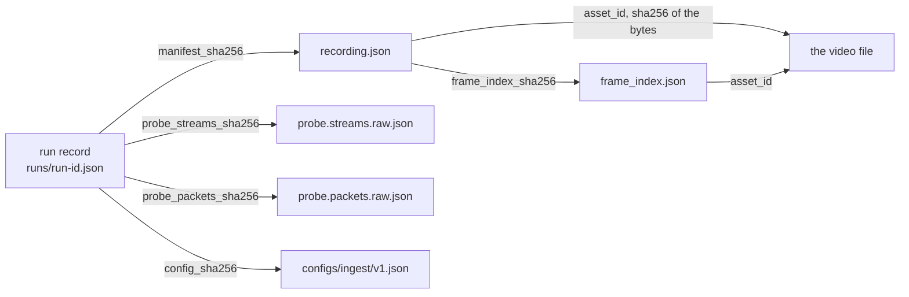

# Data model

What Stage 1 writes, how the pieces point at each other, and where every field comes from.
[`data-schema.md`](data-schema.md) is the specification and the Pydantic models under
`src/climbvision/schema/` are the ground truth for field names; this page is the map, with numbers
from a real run. The example throughout is
`tests/fixtures/video/vfr_160x120_2s.mp4`, ingested with ffprobe 8.0.

## Four kinds of file

| File | Schema id, version | Written | Varies between runs |
| --- | --- | --- | --- |
| `recording.json` | `climbvision.recording`, 3 | once per asset | no |
| `frame_index.json` | `climbvision.frame_index`, 2 | once per asset | no |
| `runs/<run_id>.json` | `climbvision.ingest_run`, 1 | once per ingest | yes: that is its job |
| `runs/<run_id>.probe.streams.raw.json`, `.probe.packets.raw.json` | none: ffprobe's own output | once per ingest | no, for the same ffprobe |

All three schemas are Pydantic models with `extra="forbid"` and `frozen=True`, registered in
`climbvision.schema.MODEL_REGISTRY`. `climbvision validate` dispatches on a document's own
`schema_id`, never on its filename, and a wrong version fails at the boundary instead of being
coerced.

## How they point at each other

An arrow means "names by hash". A run names the manifest; the manifest never names a run. That is
why the manifest stays byte-identical while run history grows, and why `MANIFEST_CONFLICT` exists:
if a config or schema change would rewrite a manifest, earlier run records would be vouching for
bytes that no longer exist, so ingest refuses instead.

## Where every field comes from

| Source | Meaning |
| --- | --- |
| `bytes` | computed from the file's bytes |
| `ffprobe` | reported by ffprobe, normalized but not altered |
| `derived` | integer arithmetic or a deterministic rule over the sources above |
| `config` | a threshold or option from versioned configuration |
| `run` | varies per execution: identity, clock, environment |
| `reserved` | `null` on purpose until a later stage defines it |

### `recording.json`

| Field | Source | Notes |
| --- | --- | --- |
| `asset_id`, `size_bytes` | `bytes` | `sha256-` and 64 hex digits of the file. The primary key and the directory name. |
| `format_name`, `format_long_name` | `ffprobe` | Container, e.g. `QuickTime / MOV` |
| `stream_count`, `video_stream_count`, `audio_stream_count` | `derived` | Counted from ffprobe's stream list. Audio presence is recorded as a fact because it is privacy-relevant. |
| `video_stream` | `ffprobe` | Codec, profile, pixel format, coded size, time base, frame rates, rotation. See below. |
| `duration_us` | `derived` | `duration_ts` times `time_base`, integer arithmetic, rounded half away from zero. `null` if the container gives no duration. |
| `video_packet_count` | `derived` | Rows in `frame_index.json` |
| `frame_index_sha256` | `derived` | SHA-256 of `frame_index.json` exactly as written |
| `demuxer_options` | `config` | `{"ignore_editlist": false}`, the option every probe call passes. It is recorded because mp4 edit lists shift reported PTS. |
| `quality` | `derived` | Four assessments, in the table below |
| `consent_record_id`, `participant_id` | `reserved` | `null`. No such models exist yet, so no structure is invented for them. |

`video_stream` carries `rotation_degrees` and `rotation_source`, one of `display_matrix`, `tag`,
`absent`, or the two `_unreadable` values with `rotation_degrees: null`. Frame rates are
`{num, den}` pairs, and `0/0` from ffprobe becomes `null`, meaning unknown.

### `frame_index.json`

One row per video packet, sorted by presentation timestamp, stored as parallel arrays so the
canonical JSON stays compact and byte-stable.

| Field | Source | Notes |
| --- | --- | --- |
| `pts`, `dts`, `duration` | `ffprobe` | Integer ticks of `time_base`, or `null` when the container wrote none. Never `0` as a stand-in. |
| `time_base` | `ffprobe` | As declared, e.g. `1/15360`. Never replaced by a frame rate. |
| `key_frame_indices`, `unknown_key_frame_indices` | `derived` | Rows whose flags contain `K`, and rows with no flags at all, so "unknown" stays distinct from "not a key frame" |
| `decode_order_differs` | `derived` | True if the demuxer did not deliver packets in presentation order |
| `packet_count`, `stream_index`, `asset_id` | `derived`, `ffprobe`, `bytes` | |

### Quality assessments

Each entry has a `flag`, a three-valued `status` (`ok`, `fail`, `unknown`), the `measurement` it
judged and the `threshold` it judged against. The thresholds are `[FIXED]` values from
`configs/ingest/v1.json`, taken from the contract and not tuned.

| Flag | Measured | Threshold | `unknown` when |
| --- | --- | --- | --- |
| `resolution_below_min` | width, height | 1920 x 1080 | either is missing |
| `frame_rate_below_min` | `avg_frame_rate` | `30/1`, compared as an exact rational | it is missing or `0/0` |
| `variable_frame_rate` | distinct gaps between consecutive PTS | at most 1 | any packet lacks a PTS, or there are fewer than 2 packets |
| `timestamps_absent` | packet count, packets with a PTS | none | never: `ok` if every packet has a PTS, else `fail` |

### `runs/<run_id>.json`

| Field | Source | Notes |
| --- | --- | --- |
| `run_id`, `created_at_utc` | `run` | Random id, UTC clock at microsecond precision |
| `asset_id`, `input_basename`, `manifest_sha256` | `bytes`, `run`, `derived` | What went in and what came out. The basename is here and nowhere in the manifest. |
| `ffprobe_version`, `probe_streams_argv`, `probe_packets_argv` | `run` | The tool and the exact arguments |
| `probe_streams_sha256`, `probe_packets_sha256` | `derived` | Hashes of the two raw files beside this record |
| `config_version`, `config_sha256` | `config` | Which thresholds judged the file |
| `climbvision_version`, `python_version` | `run` | |
| `git_commit`, `git_dirty` | `run` | `null` both when not run from a source checkout, never a guessed clean flag |

## A worked example

For the clip in the README figure:

| Value | Where it comes from |
| --- | --- |
| `time_base` = `1/15360`, `duration_ts` = `30208` | ffprobe |
| `duration_us` = `1966667` | 30208 / 15360 = 1.966666... s, in integer microseconds rounded half away from zero |
| 27 packets, PTS `0, 512, 1024, 3584, 4096, ...` | ffprobe, sorted by PTS |
| two distinct PTS deltas, `512` (33.3 ms) and `2560` (166.7 ms) | derived from the PTS column |
| `variable_frame_rate` = `fail`, measured 2, threshold 1 | derived, judged by `ingest/v1` |
| `avg_frame_rate` = `810/59`, `frame_rate_below_min` = `fail` | ffprobe, judged by `ingest/v1` |

`frame_number / avg_frame_rate` would place frame 24 at 1.748 s. The container has it at 1.867 s.
The contract's ban on timing from a frame counter is this gap, and `scripts/render_hero.py` draws it.

## Rules every document obeys

- **Canonical JSON.** Sorted keys, compact separators, UTF-8, a trailing newline, written in binary
  mode. `dumps_canonical` is the only `json.dumps` in the package.
- **No float-typed field.** Durations are integer microseconds, rates are `{num, den}`, rotation is
  integer degrees. Checked on every fixture by `test_no_written_document_contains_a_float`.
- **Unknown is an explicit `null`,** never an omitted key. A key that vanishes looks like a schema
  change.
- **No absolute path in any artifact.** ffprobe runs from the file's directory with a bare
  basename. Checked by `test_no_absolute_path_leaks_into_an_artifact`.

Everything else in [`data-schema.md`](data-schema.md) Section 1 (`DatasetRelease`, `Attempt`,
`ContactEvent` and the rest) is a documented target for a later stage, not code.
